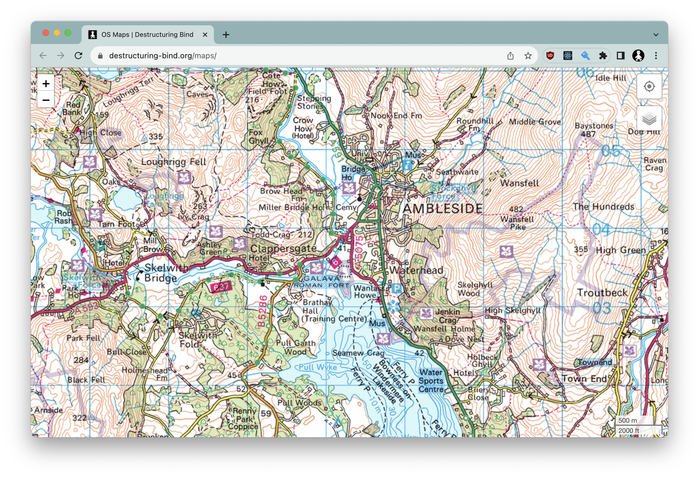
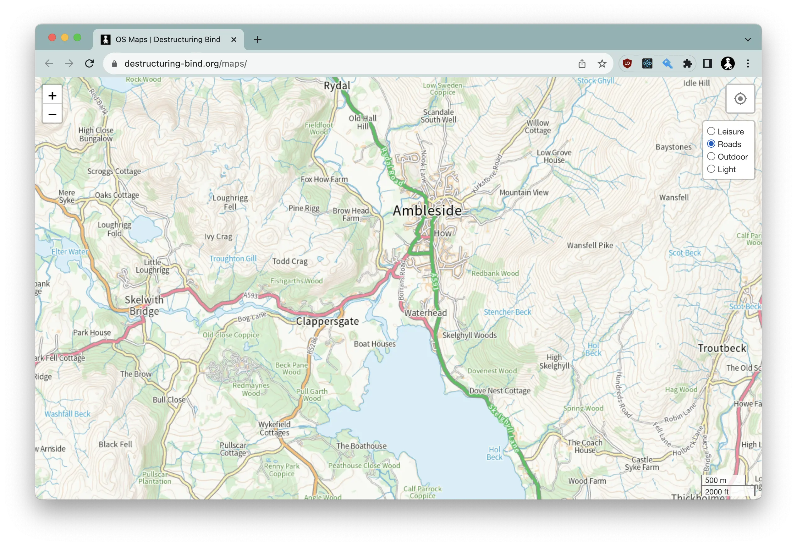

# UK Ordnance Survey Maps

This is a web application that displays UK Ordnance Survey (OS) maps, supporting multiple map styles, points of interest, and GPS track integration.

- **Live Site:** https://www.destructuring-bind.org/maps/

By default, the map will center on Ambleside. You can specify a starting location by adding a town name or postcode to the URL, for example:

- https://www.destructuring-bind.org/maps/Nottingham
- https://www.destructuring-bind.org/maps/PH1+1BD


_Leisure Map Style_


_Roads Map Style_

## Features

*   **Multiple Map Styles:** Switch between different OS map styles, including Leisure and Roads.
*   **Location Search:** Search for towns and postcodes across the UK.
*   **Points of Interest:** Display photos from [Geograph](https://www.geograph.org.uk/) as points of interest on the map.
*   **GPS Tracking:** Show your current location on the map.
*   **GPS Route Display:** Load and display GPS tracks from GPX and KML files.
*   **Measurement Tool:** Measure distances on the map.

## Key Technologies

*   **Framework:** React
*   **Language:** TypeScript
*   **Build Tool:** Vite
*   **Mapping:** Leaflet.js, React-Leaflet, maplibre-gl
*   **UI:** Chakra UI
*   **State Management:** Jotai
*   **Data Fetching:** React Query

## Running Locally

To run the application locally, follow these steps:

1.  **Clone the repository:**
    ```bash
    git clone https://github.com/r-hull/maps.git
    cd maps
    ```

2.  **Create an environment file:**

    Create a `.env` file in the root of the project with the following content:

    ```env
    VITE_OS_DATAHUB_API_KEY=<your OS Datahub API key here>
    VITE_GEOGRAPH_API_KEY=<your Geograph API key here>
    ```

    You will need to sign up for free accounts on the [OS DataHub](https://osdatahub.os.uk/) and [Geograph UK](https://www.geograph.org.uk/) to obtain these API keys.

3.  **Install dependencies:**
    ```bash
    yarn install
    ```

4.  **Run the development server:**
    ```bash
    yarn dev
    ```

    The application will be available at http://localhost:5173 (or the next available port).

## Hosting Yourself

This project includes a GitHub Actions workflow to automatically deploy the application to GitHub Pages.

1.  **Fork the repository.**
2.  **Enable GitHub Pages:** In your repository settings, under "Pages", set the source to "GitHub Actions".
3.  **Create repository secrets:** In your repository settings, under "Secrets and variables" > "Actions", create the following secrets:
    *   `VITE_OS_DATAHUB_API_KEY`: Your OS Datahub API key.
    *   `VITE_GEOGRAPH_API_KEY`: Your Geograph API key.

The workflow will then build and deploy the application automatically.

## Attribution

*   Leaflet marker icons sourced from [pointhi/leaflet-color-markers](https://github.com/pointhi/leaflet-color-markers).

## License

This project is licensed under the MIT License. See the [LICENSE.md](LICENSE.md) file for details.