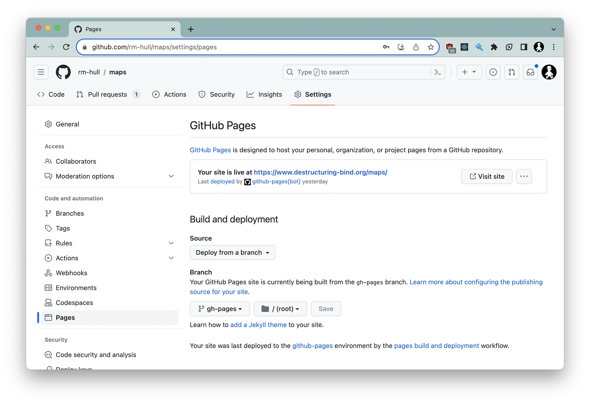

# Maps

UK Ordance Survey maps, supporting multiple styles and points of interest. By default, visiting https://www.destructuring-bind.org/maps/ will center on Ambleside (for no particular reason). If you want to start (or sniff around) at a particular town or postcode, add it to the URL, e.g. https://www.destructuring-bind.org/maps/Nottingham or https://www.destructuring-bind.org/maps/PH1+1BD


## Runing it locally

Create an `.env` file in the root folder, with the following keys:

```env
REACT_APP_OS_DATAHUB_API_KEY=<your OS Datahub API key here>
REACT_APP_GEOGRAPH_API_KEY=<your Geograph API key here>
```

You will need to sign up for accounts on the [OS DataHub](https://osdatahub.os.uk/)
and [Geograph UK](https://www.geograph.org.uk/) and obtain API keys. 

Then `yarn install` to pull in all the dependencies, while `yarn start` will run the app
in development mode. Open http://localhost:3000 to view it in the browser.

The page will reload if you make edits. You will also see any lint errors
in the console.

## Hosting yourself

Fork the repo, and Github actions will/should deploy the app to Github pages. You will almost
certainly have to manually edit your settings to deploy from the `gh-pages` branch:



And then, create secrets from the API keys:


## MIT License

Copyright (c) 2021 Richard Hull

Permission is hereby granted, free of charge, to any person obtaining a copy
of this software and associated documentation files (the "Software"), to deal
in the Software without restriction, including without limitation the rights
to use, copy, modify, merge, publish, distribute, sublicense, and/or sell
copies of the Software, and to permit persons to whom the Software is
furnished to do so, subject to the following conditions:

The above copyright notice and this permission notice shall be included in all
copies or substantial portions of the Software.

THE SOFTWARE IS PROVIDED "AS IS", WITHOUT WARRANTY OF ANY KIND, EXPRESS OR
IMPLIED, INCLUDING BUT NOT LIMITED TO THE WARRANTIES OF MERCHANTABILITY,
FITNESS FOR A PARTICULAR PURPOSE AND NONINFRINGEMENT. IN NO EVENT SHALL THE
AUTHORS OR COPYRIGHT HOLDERS BE LIABLE FOR ANY CLAIM, DAMAGES OR OTHER
LIABILITY, WHETHER IN AN ACTION OF CONTRACT, TORT OR OTHERWISE, ARISING FROM,
OUT OF OR IN CONNECTION WITH THE SOFTWARE OR THE USE OR OTHER DEALINGS IN THE
SOFTWARE.
